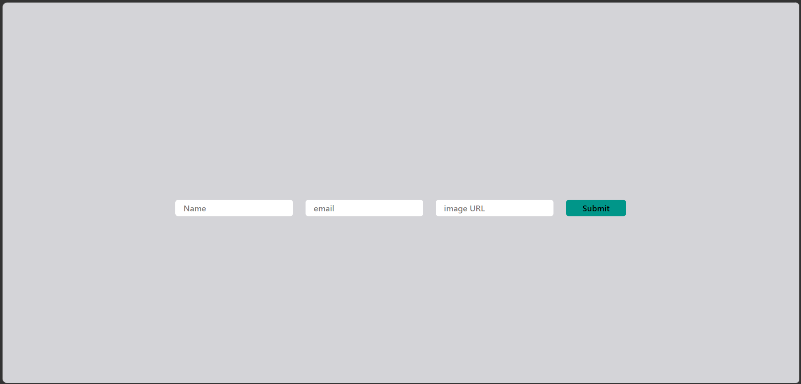
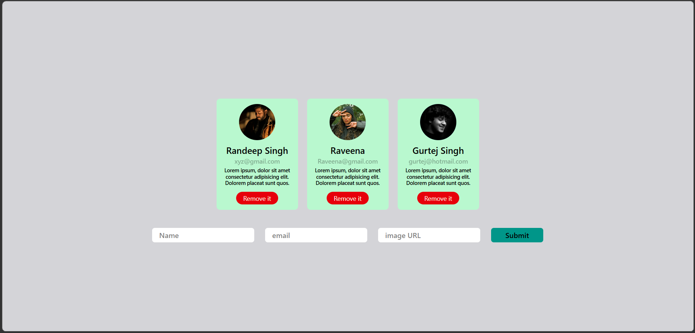

# 👤 User Card App

A lightweight React application for creating, displaying, and managing user profile cards. Users can input details via a form and dynamically render them as UI cards.

---

## 📌 Description

This project demonstrates core frontend concepts such as component-based architecture, state management, and form handling using modern React practices.

--- 
## 🔗 Live Demo

👉 [View Live Project](https://id-card-zeta-three.vercel.app/)

---

## 📸 Screenshots

## 🖥️ App Preview

 
### 🏠 Home (Add User)

### ✏️ Edit Task Mode

---

## 🧠 Key Concepts
- React Hooks (useState)
- Component communication via props
- Array rendering using map()
- Event handling in React
- Controlled forms using react-hook-form

---

## 🔄 Application Flow
1. User enters details in the form
2. Form submits data to parent component
3. Data is stored in state
4. UI updates and displays new user card
5. User can remove any card

---

## 🚀 Features

- Create user profiles (name, email, image)
- Dynamic rendering of user cards
- Remove users from the list
- Clean and reusable component structure
- Form handling with react-hook-form

---

## 🛠️ Tech Stack

- **Frontend:** React (Vite)
- **Styling:** Tailwind CSS
- **Form Handling:** react-hook-form
- **Language:** JavaScript (ES6+)

---

## 📂 Project Structure
src/
 
├── components/
 
│ ├── Learn4Form.jsx # Handles user input form
 
│ ├── Learn4Card.jsx # Renders list of user cards
 
│ └── Learn4Cards.jsx # Individual user card component
 
│
 
├── App.jsx # Main application logic
 
└── main.jsx